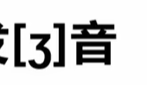
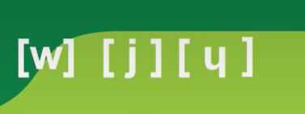
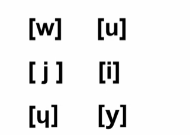

- [2023.11.01](#20231101)
  - [概述](#概述)
- [2023.11.02](#20231102)
  - [\[f v \];\[t d\];\[p,b\];\[k g\]](#f-v-t-dpbk-g)
- [2023.11.08](#20231108)
- [E](#e)
- [2023.11.17:](#20231117)
  - [音节的划分](#音节的划分)
  - [辅音群](#辅音群)
  - [S](#s)
  - [Z](#z)
  - [C](#c)
  - [O](#o)
- [2023.11.22](#20231122)
  - [Q](#q)
  - [K](#k)
  - [G](#g)
- [2023.11.23](#20231123)
  - [X](#x)
- [2023.11.24](#20231124)
  - [J](#j)
- [2023.11.29](#20231129)
  - [三个半元音音素(半辅音素)](#三个半元音音素半辅音素)

# 2023.11.01
## 概述

    26个字母和英语一样36个元素；  
    元音字母：a o u e i y;  
    大多数辅音字母再单词的结尾如果没有符号是不发音的  
    **q c l r f 这个五个除外**  
    俩个相同的辅音字母在同一个单词中 只一发个音  
    都法语的时候要注意是有点紧绷的感觉的   
	
# 2023.11.02
## [f v ];[t d];[p,b];[k g]

    - 清浊辅音转换规则(后面俩组当爆破音在元音音素之前时，要转换为对应的浊音，但是有一点区别，浊化后不是喉咙发音而是在口腔居多) 
  	前面声带是不震动的，后面的震动很大的；  
  	注意那个转换，当在辅音群和音节末是不转换的   

# 2023.11.08
# E
e的发音：有四种情况：

	1：-（呃）：圆唇，比较放松的状态，舌根不要抬起   

    --在单音节词尾（这个单词只有一个音节）
    --在词首开音节（即这个单词的第一个音节是开音节且e是属于它的(以元音字母结尾的音节时开音节)）
    --辅辅e辅音（e是字母，辅代表的是辅音音素：）

	2：(ai注意这个发音时舌头是顶住下牙的，不要向闭口方向滑动)
	--在闭音节（以辅音音素结尾的单词）中。
	--带了开音符(向下的小斜线)，长音符(小帽子)，分音符（俩点）：
	一个小帽子是适当延长发音；向下的那个是开音符，不改变发音只是用来区分单词的；两点是表示这个发音要和前面的元音
	分开发音，不能进行组合

	3：（a发音时不要向开闭口方向滑动）
	闭音符:向上的一个小斜线（这个符号只会出现在e这里）
	--标注了闭音符
	hmm闭音符是用来干啥的嘞
	
	4：不发音：  
    --元辅e辅元；  
    --在非单音节的结尾的e

# 2023.11.17:
## 音节的划分  
    元|辅元 //注意这里指的是音素而不是字母
    元辅|辅元
    元辅辅|辅元
## 辅音群  
**[p b,k g]和[l] [r] && [t d]和[r]  这俩组音素之间的组合** 
 
    --组合之后作为整体就算出现在元音音素之前并不浊化，还是会送气 
    --相连的俩个辅音音素要分开，但是辅音群是不分开的
## S

    --【s】:ss/s一般情况下都是发这个音的
    --【z】：
  **元s元**：这里的元是元音字母，即使不发音也算数，注意是一个s，俩个s还是发【s】的

## Z
- 直接就是[z]

## C

    【k】：注意浊化
    --在字母a o u前
    --在辅音字母前
    --在词尾
    --比较特殊的：
    。字母cc在字母e i前面发[ks]
    。ch在少数词里发[k]:
    chlore;choral;technique;
    【s】：
    --在字母 e i y前面
    --带软音符号(下面有一条小尾巴)
    --比较特殊的情况：
    .sc在字母e i前面整体发[s]
    .ti遇到另外一个元音字母，t发[s]（确定是字母奥）

## O    

    开口音：/ɔ/
    --在词首或者词中;
    --在闭音节中(除了在音节z前)  
    闭口音：/o/
    --在词末开音节中；
    --在闭音节中且在**音节**z前面；
    --有长音符；（一个小帽子）
    --一些组合：-one;-ome结尾的少数词；
# 2023.11.22
## Q
- 清浊辅音对 [k g] 遵循浊化规则

- 在词末(去吃卤肉饭) && 组合qu 
- 发【k】

## K
- 字母k && 组合ck
- 发【k】

## G
- 发【g】
- 在**字母**a o u && 辅音**字母**前 && gu在字母 e i y前  && 在少数词词词尾*zigzag* *gong*

- 发【j】
- 在字母 e i y && ge 在字母 a o

# 2023.11.23
## X

    【ks】:一般情况下；
    【gz】：
    在词首作为ex-字母组合 且 后面是元音音素：
    字母x的音素是[gz],[gz]不一定要绑在一起读，是要根据音节划分的规则来读的
    【s】：
    在少数词中：six(6)；dix(10)

# 2023.11.24
## J
  直接发：  

# 2023.11.29
## 三个半元音音素(半辅音素)
- 发音很像对应的元音，但是又可以像辅音那样进行组合
 
- 发音技巧：找到对应的元音 然后快速的滑过去

- 【j】  

      1.字母i在元音音素前
      2.字母i加了分音符(俩个小点) 在俩个元音音素中间
      3.字母y在词首 且 后面为元音音素 
- 【w】  

      1.ou字母组合在元音音素前
      2.字母w 在少数词中 ：watt
- 最后一个
  字母u在元音音素前

  