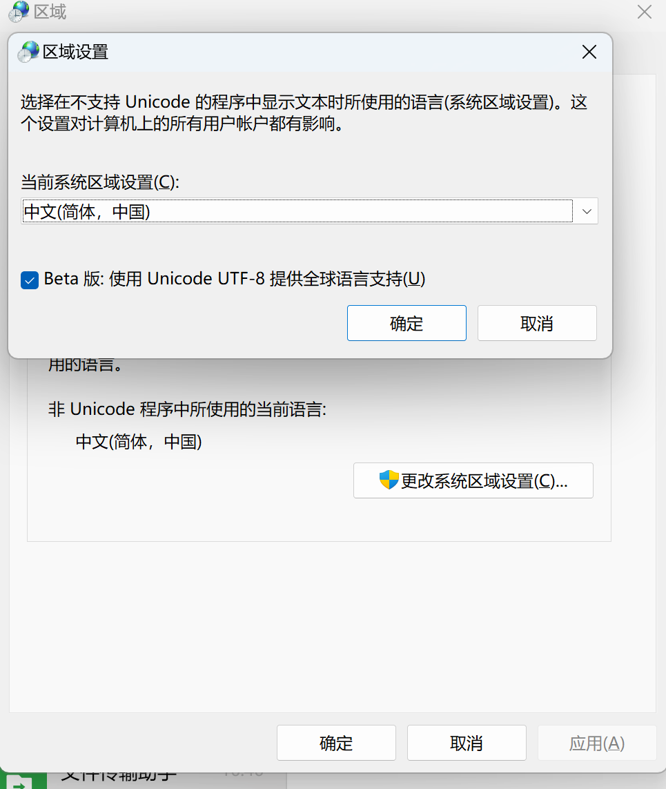
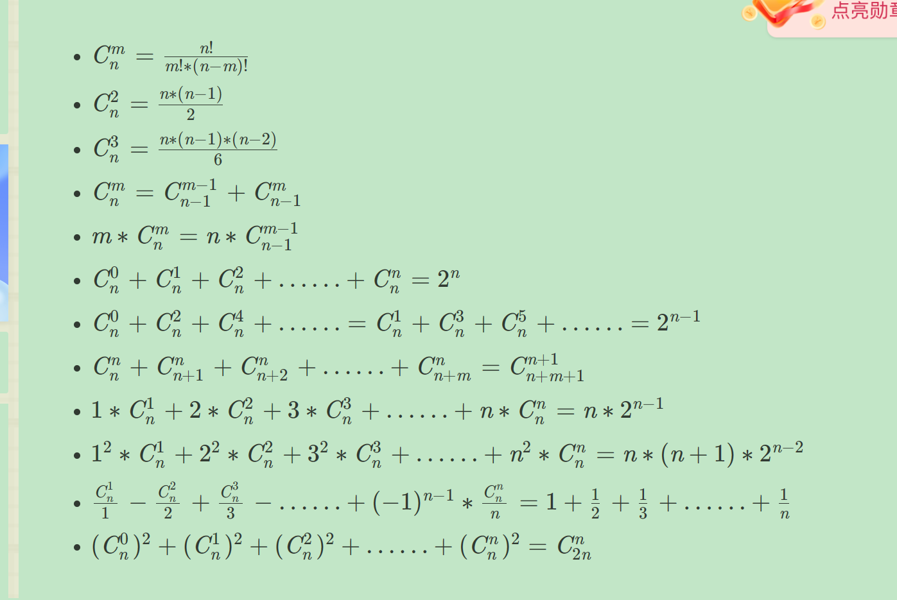

- [2023.12.04](#20231204)
  - [windows快捷键](#windows快捷键)
  - [路由器+树莓派的连接和使用](#路由器树莓派的连接和使用)
  - [vscode快捷键](#vscode快捷键)
- [2023.12.05](#20231205)
  - [算法](#算法)
    - [同余数定理](#同余数定理)
    - [long long 范围内所有01组合的数字，用宽搜怎么全部覆盖](#long-long-范围内所有01组合的数字用宽搜怎么全部覆盖)
  - [学习是遇到问题比较好用的工具](#学习是遇到问题比较好用的工具)
  - [怎么学习编程 john fish](#怎么学习编程-john-fish)
  - [linux 内核怎么玩](#linux-内核怎么玩)
- [2023.12.06](#20231206)
  - [chatgpt、stackoverflow的使用](#chatgptstackoverflow的使用)
  - [youtube安卓手机的使用](#youtube安卓手机的使用)
  - [取模运算](#取模运算)
- [2023.12.07](#20231207)
  - [算法代码模板一些小tips](#算法代码模板一些小tips)
  - [动态规划：最长上升子序列模型](#动态规划最长上升子序列模型)
  - [二分](#二分)
  - [C++直接输入一整个数组，且没有标注长度，可以这样](#c直接输入一整个数组且没有标注长度可以这样)
- [2023.12.08](#20231208)
  - [vscode配置C++环境](#vscode配置c环境)
  - [组合数的常用公式](#组合数的常用公式)
  - [指法](#指法)
  - [戴老师最开始推荐的openharmony学习链接](#戴老师最开始推荐的openharmony学习链接)
- [2023.12.11](#20231211)
  - [最大连续M个子段和](#最大连续m个子段和)
- [2023.12.11](#20231211-1)
  - [最大连续M个字段和](#最大连续m个字段和)
  - [当M=1时的俩种思路](#当m1时的俩种思路)
    - [1：关于数组的问题：试着用前缀或者后缀 类似的方法解决；](#1关于数组的问题试着用前缀或者后缀-类似的方法解决)
    - [2：关于某一段的问题：试着从结尾/开头的必然是哪个数，hmm想一想好像也是用前/后缀解决奥；](#2关于某一段的问题试着从结尾开头的必然是哪个数hmm想一想好像也是用前后缀解决奥)
  - [基于对M=1的直接衍生w](#基于对m1的直接衍生w)
    - [但是这个初始化仍有不理解的地方在](#但是这个初始化仍有不理解的地方在)
- [2023.12.13](#20231213)
  - [最大连续M个字段和](#最大连续m个字段和-1)
- [2023.12.14](#20231214)
  - [DP（Algorithm by MIT）](#dpalgorithm-by-mit)
- [2023.12.15](#20231215)
  - [DP (Algorithm by MIT)](#dp-algorithm-by-mit)
- [2023.12.19](#20231219)
  - [当树莓派用hdc连接不上的解决方案](#当树莓派用hdc连接不上的解决方案)
  - [Rust中一行字符串中空格的处理](#rust中一行字符串中空格的处理)
  - [Rust中返回关于option的处理](#rust中返回关于option的处理)
  - [Rust中str和u32之间的转换](#rust中str和u32之间的转换)
# 2023.12.04
## windows快捷键
- “讲述人”的键盘快捷方式按Windows 微标键 + Ctrl + Enter 打开和关闭“讲述人"，阅读电脑屏幕

## 路由器+树莓派的连接和使用
- 将树莓派和路由器用网线连接
- 登录路由器的官网 192.168.101.1
- 在终端设备里面查找在线设备
- 在线设备的地址就是树莓派的地址

## vscode快捷键
- Ctrl + [ 和 Ctrl + ]，可以实现代码的向左移动或者向右移动。
- Shift + Alt + F，可以对齐选中的代码块，代码奥，刚刚试了一下文字不可以
- Ctrl +shfit +F ,可以在文件中查找选中内容

# 2023.12.05
## 算法
### 同余数定理
### long long 范围内所有01组合的数字，用宽搜怎么全部覆盖

## 学习是遇到问题比较好用的工具
chatgpt 
GitHub Copilot
stack overflow

## 怎么学习编程 john fish
- 写代码最好是面向项目的
- 想到了想做的项目，就去开始构建一个，哪怕最开始只有一个标题
- 中间遇到困难了，可以使用工具，但是不要只是复制粘贴代码
- 保持兴趣！

## linux 内核怎么玩
- 下载安装内核
- 在操作之前建议先保存一个安全的镜像，防止等下玩坏了
- 可以更改一些配置啥的，看看有啥不一样了
- 写写代码，比如有版本更新了，可以看看哪的代码不一样了


# 2023.12.06
## chatgpt、stackoverflow的使用
- chatgpt的官网，不可以使用QQ邮箱注册，并且貌似是要收费的
- 然后使用了[forefront](https://www.forefront.ai/app/chat/new),用谷歌账号是可以登录的
- stackoverflow直接去官网用谷歌账号登录即可，但是在搜索问题是都是英文
- 然后使用了[stackoom](https://stackoom.com/)不可以提问，但是支持中文

## youtube安卓手机的使用
- 在谷歌官网搜索它的安卓版安装包即可，目前已经下载了一个可用的，但是网址找不到了

## [取模运算](https://blog.csdn.net/Mtrix/article/details/47087647)


# 2023.12.07
## 算法代码模板一些小tips
```C
#define loop(i,a,b) for(int i=a;i<=b;i++)
#define pool(i,a,b) for(int i=a;i>=b;i--)
#define int long long
```

## 动态规划：最长上升子序列模型
- 暴力dp，遍历以1~n结尾的子序列的最大值
- 贪心+二分：维护一个数组，f[i]：长度为i的序列，目前末尾数最小的；可以简单证明
- 该数组是单调不减的；然后二分即可；注意这个得出的长度是正确的，但是由他得出的序列不是正确的；
- 单调不减的证明提示[1,2,4,a,..,b]:b一定大于a，这个证明没那么复杂奥，根据f[i]组成的序列，
- 或者直接根据每次二分来维护的数组，就是单调不减的奥；
[优化版参考链接](https://blog.csdn.net/lxt_Lucia/article/details/81206439?ops_request_misc=%257B%2522request%255Fid%2522%253A%2522170193465416800215073743%2522%252C%2522scm%2522%253A%252220140713.130102334.pc%255Fall.%2522%257D&request_id=170193465416800215073743&biz_id=0&utm_medium=distribute.pc_search_result.none-task-blog-2~all~first_rank_ecpm_v1~rank_v31_ecpm-15-81206439-null-null.142^v96^pc_search_result_base1&utm_term=%E6%9C%80%E9%95%BF%E4%B8%8A%E5%8D%87%E5%AD%90%E5%BA%8F%E5%88%97%E7%9A%84%E4%BC%98%E5%8C%96&spm=1018.2226.3001.4187)

## 二分
- 以优化版的最长上升子序列为例：找的是最后一个<x的f[i]；
- 它的下一个则是第一个大于等于x的,

二分模板
```C
    	while (l < r)
    {
        int mid = l + r >> 1;	//(l+r)/2
        if (check(mid))  r = mid;    // check()判断mid是否满足性质
        else l = mid + 1;
    }

    	while (l < r)
    {
        int mid = l + r + 1 >> 1;	//(l+r+1)/2
        if (check(mid))  l = mid;
        else r = mid - 1;
    }

```
[二分参考链接](https://blog.csdn.net/Mr_dimple/article/details/114656142?ops_request_misc=%257B%2522request%255Fid%2522%253A%2522170193569016800215089711%2522%252C%2522scm%2522%253A%252220140713.130102334..%2522%257D&request_id=170193569016800215089711&biz_id=0&utm_medium=distribute.pc_search_result.none-task-blog-2~all~top_positive~default-1-114656142-null-null.142^v96^pc_search_result_base1&utm_term=%E4%BA%8C%E5%88%86&spm=1018.2226.3001.4187)

## C++直接输入一整个数组，且没有标注长度，可以这样
```
输入：[1, -2, 3, 10, -4, 7, 2, -5]
输出：18
```
```C++ 
    class Solution {
        public:
          int maxSubArray(vector<int>& nums) {
              //不知道为啥在这里int的范围报错了
          }
    };
```
其他小tips：
- gem和opengl也有关系，gpu、opengl、gles、egl、drm、vc4、v3d、gbm、gem，这些都可以算opengl一类，和显示有关好像
- int的取值范围正负2e9 0x3f3f3f3f大概是1e9左右


# 2023.12.08
## vscode配置C++环境
- 配置[参考链接](https://blog.csdn.net/qq_53303187/article/details/128581104?ops_request_misc=%257B%2522request%255Fid%2522%253A%2522170201724516800197052231%2522%252C%2522scm%2522%253A%252220140713.130102334.pc%255Fall.%2522%257D&request_id=170201724516800197052231&biz_id=0&utm_medium=distribute.pc_search_result.none-task-blog-2~all~first_rank_ecpm_v1~rank_v31_ecpm-1-128581104-null-null.142^v96^pc_search_result_base1&utm_term=vscodeC%2B%2B%E5%BC%B9%E5%87%BA%E5%8D%95%E7%8B%AC%E7%9A%84%E7%AA%97%E5%8F%A3%E4%B8%80%E9%97%AA%E8%80%8C%E8%BF%87&spm=1018.2226.3001.4187)  
- 下载[vscode](https://code.visualstudio.com/download),下载[mingw-x86win32seh](https://sourceforge.net/projects/mingw-w64/files/mingw-w64/mingw-w64-release/)
- 将下载的mingw解压到programs路径下，将对应的路径配置到环境变量中：
```vscode
{
  // 使用 IntelliSense 了解相关属性。 
  // 悬停以查看现有属性的描述。
  // 欲了解更多信息，请访问: https://go.microsoft.com/fwlink/?linkid=830387
  "version": "0.2.0",
  "configurations": [
    {
      "name": "(gdb) 启动",
      "type": "cppdbg",
      "request": "launch",
      "program": 
      "C:\\Windows\\system32\\cmd.exe",//生成的可执行文件的名称为name.exe",
      "args": [
        "/C",
        "${fileDirname}\\output\\a.exe",
        "&",
        "pause"
      ],//这里面的参数解决弹出的终端闪退问题
      "stopAtEntry": false,
      "cwd": "${fileDirname}",
      "environment": [],
      "externalConsole": true, //这里设置完之后，点击三角形依旧是在终端输出，要按ctrl+f5（只运行不编译）
      "MIMode": "gdb",
      "miDebuggerPath": "C:\\Program Files\\mingw64\\bin\\gdb.exe",
      "setupCommands": [
          {
              "description": "为 gdb 启用整齐打印",
              "text": "-enable-pretty-printing",
              "ignoreFailures": true
          },
          {
              "description": "将反汇编风格设置为 Intel",
              "text": "-gdb-set disassembly-flavor intel",
              "ignoreFailures": true
          }
      ]
    }

  ]
}
```
- 配置task.json
```vscode
{
  "tasks": [
      {
          "type": "cppbuild",
          "label": "C/C++: g++.exe 生成活动文件",
          "command": "C:\\Program Files\\mingw64\\bin\\g++.exe",
          "args": [
            //   "-fdiagnostics-color=always",
               "${file}",
              // "*.cpp",编译当前文件夹下的所有文件
              "-o",
              // "${fileDirname}\\${fileBasenameNoExtension}.exe"
              "${fileDirname}\\output\\a.exe",//生成的可执行文件的名称为name.exe
              "-fexec-charset=GBK",//显示中文
              "-std=c++11"
          ],
          "options": {
              "cwd": "${fileDirname}"
          },
          "problemMatcher": [
              "$gcc"
          ],
          "group": {
              "kind": "build",
              "isDefault": true
          },
          "detail": "调试器生成的任务。"
      }
  ],
  "version": "2.0.0"
}
```
- 上述俩个文件参数的一些解释：
```markdown
除了 "fileBasenameNoExtension"，在VSCode中还有一些其他类似的变量可以用于动态引用文件名或路径，比如：

- **fileDirname**: 当前文件的目录路径。
- **fileExtname**: 当前文件的扩展名。
- **fileWorkspaceFolder**: 当前文件所在的工作区根目录路径。
- **relativeFile**: 当前文件相对于工作区根目录的路径。

这些变量可以在配置任务、调试或其他设置时使用，使得配置更加灵活和通用。

```

- 如果在确定上述俩个文件的路径是正确的，但是还是报错launch.json的路径找不到
`设置里面搜索区域设置->管理语言设置->更改系统区域设置->勾选下图的小对号`


## 组合数的常用公式


## 指法
- 再练习的时候追求准确率，不是速度奥
- 俩个手尽量保持在基准键位；
- []可以让输入法翻页
- 下图是建议图


## 戴老师最开始推荐的[openharmony学习链接](https://docs.openharmony.cn/pages/v3.2/zh-cn/device-dev/driver/driver-overview-foundation.md/)

# 2023.12.11
## 最大连续M个子段和
- 看题解的时候一定要注意状态划分！！！这个不正确会引发血案，如果觉得状态划分题解讲的不太清楚，找另一篇题解，learn from best
- 这里面对上一层的处理很nice；
- 本质上还是根据m=1来延伸的
[参考题解](https://blog.csdn.net/FK_ACM/article/details/49933619?ops_request_misc=&request_id=&biz_id=102&utm_term=hdu%201024&utm_medium=distribute.pc_search_result.none-task-blog-2~all~sobaiduweb~default-8-49933619.142^v96^pc_search_result_base1&spm=1018.2226.3001.4187)

# 2023.12.11
## 最大连续M个字段和
- 对题解的解题思路又分析了一下；
- 题解的思路,f(i,j)=max(f[i][j-1],max(f[i-1][i-1~j-1]))+a[j];然后很巧妙地用一维数组维护了max(f[i-1][i-1~j-1])，
然后剩下一个也用一维数组优化了（是本层的所以不需要滚动数组哦）
- **只要f[i][j]是用f[i/i-1][0~maxn]更新的，都可以用一维数组优化,i/j的含义可以根据这个状态转移方程调整**
- **这个状态转移方程我开始的思路是以最后一段的长度来划分的，没有想到如果i不单独一组，必定是可以用前面的i-1来更新的；**
## 当M=1时的俩种思路
### 1：关于数组的问题：试着用前缀或者后缀 类似的方法解决；
- f[i]：前i个中的可能的字段和；g[i]:前i个且以i结尾的所有可能字段和;属性：最大；
- 状态计算:g[i]=max(g[i-1],g[i-1]+a[i]); f[i]=max(f[i-1],g[i]);
- g[0],f[0]可计算，无后效性；
### 2：关于某一段的问题：试着从结尾/开头的必然是哪个数，hmm想一想好像也是用前/后缀解决奥；
- 输出最大后缀和即可

## 基于对M=1的直接衍生w
- f[i][j]:从前j个中选i段的所有可能性；g[i][j]:从前j个中选i段&&以第j个数结尾的所有可能性；属性max
- 状态计算：g[i][j]的思路和题解一样，f[i][j]=max(f[i][j-1],g[i][j]);
- 根据f[1][1]肯定==a[1]，判断应该是无后效性的；

### 但是这个初始化仍有不理解的地方在

# 2023.12.13
## 最大连续M个字段和
- 对题解的解题思路又分析了一下,很多题解说的状态的意思不太对奥,f(i,j)指的是选i段，不是前j个数总共划分成i段；
- 题解的思路,f(i,j)=max(f[i][j-1],max(f[i-1][i-1~j-1]))+a[j];然后很巧妙地用一维数组维护了max(f[i-1][i-1~j-1])，
- 故初始化的时候，pre[i]==0,保证第一层的数据是正确的；
- 因为状态计算的时候，保证了pre[j-1]一定是不小于f[j-1]的，故可以忽略这一层使用f[i][i-1]是不合理的
- 且在状态计算的时候，j的值没有重复过，故一定是不相交的；
- 详细思路的代码，g[N]这个类似M=1时，是可以去掉的
- **状态划分十分确定和题意完全符合，不然后面的状态计算，和初始化容易出错！！！**
```C++
#include<iostream>
using namespace std;
typedef long long LL;
typedef pair<int,int>P;
#define loop(i,a,b) for(int i=a;i<=b;i++)
#define pool(i,a,b) for(int i=a;i>=b;i--)
#define io ios::sync_with_stdio(0),cin.tie(0),cout.tie(0)
const int N=1000010;
const LL inf=1e17;
LL a[N],f[N],g[N],lar[N],bk[N];

// f[i][j]:从前j个中选i段的所有可能性；g[i][j]:从前j个中选i段&&以第j个数结尾的所有可能性；属性max

void solve()
{
    int n,m;
    while(~scanf("%d%d",&m,&n))
    {
        LL ans;
        for(int i=1;i<=n;i++)scanf("%lld",&a[i]),f[i]=-inf,lar[i]=0,g[i]=-inf;
        g[0]=-inf;
        // f[0]=0,lar[0]=0;
        for(int i=1;i<=m;i++)
        {
            ans=-inf;
            for(int j=i;j<=n;j++)
            {
                f[j]=max(f[j-1],lar[j-1])+a[j];
                lar[j-1]=ans;
                ans=max(ans,f[j]);
            }
        // for(int j=1;j<=n;j++)
        // printf("i=%d: lar[%d]=%lld,f[%d]=%lld\n",i,j,lar[j],j,f[j]);
        }
        
        for(int i=1;i<=m;i++)
        {
        //   memcpy(bk,g,sizeof g);
          g[i-1]=-inf;
          for(int j=i;j<=n;j++)
          g[j]=max(g[j-1],f[j]);
        //   printf("i=%d:g[%d]=%lld %lld\n",i,j,g[j],f[j]);
        }
       
        

        printf("%lld\n",g[n]);
    }
}

int main()
{
  int t=1;
  //cin>>t;
  while(t--)solve();
  return 0;
}

//10 10 -6 -6 -7 -4 5 -1 -3 2 -2 -10
```

# 2023.12.14
## DP（Algorithm by MIT）
- 递归算法计算公式（有归纳法证明的思路）
- S：subproblem defination
- R: relate subproblem solutions recursively
- T: toplogicd order on subprobs;(have DAG)
- B: base cases of relation
- O: Orignal probs
- T: Time about this 

- 序列问题：可从前后缀，字串考虑（连续的）
- 多个输入序列： 多个序列空间相乘（现在的理解是循环个数是和序列个数对应的）

- 父指针，可以记录路径

# 2023.12.15
## DP (Algorithm by MIT)
- 课程讲义以及其他获取[链接](https://ocw.mit.edu/courses/6-006-introduction-to-algorithms-spring-2020/pages/lecture-notes/)

- DP 
- 1.当在状态计算的时候遇到了问题，可以试试增加数组维度/增加子问题的个数/增加子问题的限制条件----就算这些子问题不是和原来的问题直接相关，只要可以在允许的时间复杂度中推导出来就是ok的，
- 2.在计算中不可以线性的计算子问题的答案，可以先试试暴力枚举子问题的所有可能性；
- 注意综合考虑 加了限制条件/子问题个数 和 题目要求的时间复杂度

# 2023.12.19
##  当树莓派用hdc连接不上的解决方案
- 首先固定一下网线的俩边接口
- 重启后连接显示屏(注意显示屏的电源线(DC)的电压要大一点 不然会出问题)
- 如果显示屏显示系统有问题，先试试重新烧录镜像
- 如果还是有问题，查找系统的问题，如果查不出来，重新拉取编译代码

## Rust中一行字符串中空格的处理
## Rust中返回关于option的处理
## Rust中str和u32之间的转换
```rust
    let mut args = args.split_whitespace();//返回的是迭代器
    let addr:Option<&str> = args.next();//这个指向的是迭代器中的第一个元素
    let count:u32 = args.next().unwrap_or("1").parse().unwrap_or(1);
    //第一个将option解包，parse返回result，第三个如果result返回err设置默认值为1
    let addr: &str = addr.unwrap();

    //这上面使用到的函数都是在标准库里面的
    for i in 0..count{
        let mut ad: u32=addr.parse().unwrap();//str转换成u32
        ad=ad+i*4;
        let mut temp: String = ad.to_string();//u32转换成string
        if let Err(e)=ldr_one(&temp){
            println!("ldr {} {}", temp, e);
        }
    }  
```


  


