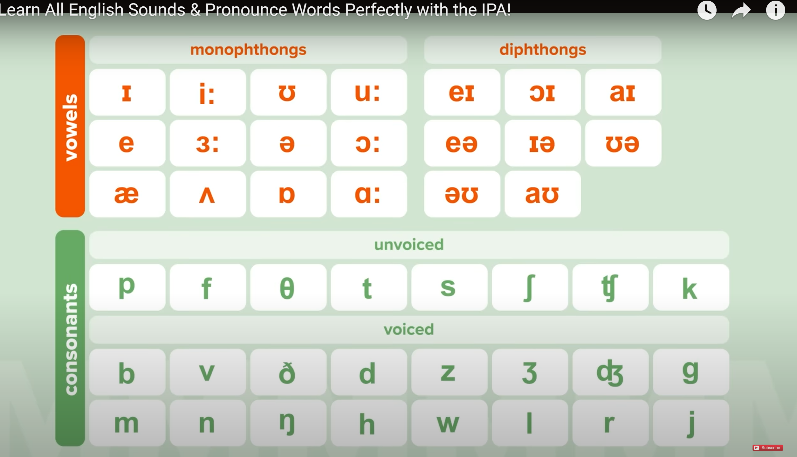

# 2023.12.13
## 拼写技巧
- 前缀
- 后缀
- i before e excpet after c
- 常见的字母组合
- a o u e i 如果发音和字母相似末尾就需要一个不发音的e  否则不需要
- 英式和美式
  
## 音节划分
- 整的来说根据发音的元音音节来划分
- 元(1|1)/(1|2)元，一起发音的不可以拆开;//1|1==辅|辅
- 元音 |辅音 较短的元音  较短元音 辅音|  元音
- 元|元
- ...+ck| le 以ckle结尾的单词
- ..|辅音+le 以辅+le结尾的单词

## IPA音标


# 2023.12.15
## 句子中的重读
- 实词重读/语法词(读的更快更轻) but重读是比较灵活的  可以根据想表达的意思有所更换：
- 有些词单独和在句子里面的发音是可以不一样的 有些词在单词中是有弱音的
- 大多数名词、动词、形容词、副词没有轻音
- 介词(to ...)、代词(you ...)、连词(and but...)、助动词(do does ...)一般是有弱音的
```
Strong Forms vs Weak Forms a /eɪ/, /ə/ an /æn/, /ən/ his /hɪz/, /ɪz/ our /ˈaʊə/, /ɑː/ some /sʌm/, /səm/ the /ðiː/, /ðə , ðɪ/ your /jɔː/, /jə/ and /ænd/, /ən/ as /æz/, /əz/ but /bʌt/, /bət/ than /ðæn/, /ðən/ that /ðæt/, /ðət/ at /æt/, /ət/ for /fɔː/, /fə , fr/ from /frɒm/, /frəm/ of /ɒv/, /əv, ə/ to /tuː/, /tə/ he /hiː/, /iː/ her /hɜː/, /ɜː , ə/ him /hɪm/, /ɪm/ them /ðem/, /ðəm, əm/ us /ʌs/, /əs, s/ am /æm/, /əm, m/ are /ɑː/, /ə/ can /kæn/, /kən/ do /duː/, /də, d/ does /dʌz/, /dəz/ had /hæd/, /həd , əd, d/ has /hæz/, /həz , əz , z , s/ have /hæv/, /həv , əv, v/ is /ɪz/, /z , s/ must /mʌst/, /məst/ shall /ʃæl/, /ʃəl, l/ was /wɒz/, /wəz/ were /wɜː/, /wə/ will /wɪl/, /əl, l/ would /wʊd/, /əd, d/
收起

```