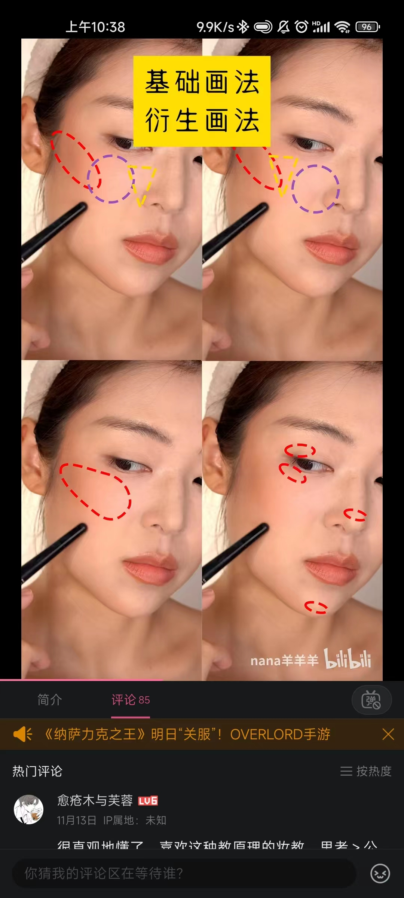

- [2023.11.23](#20231123)
  - [修容：](#修容)
  - [**腮红**](#腮红)
# 2023.11.23
## 修容：
- 使用的工具：  
  不同色号的粉底液 && 修容膏：比较自然，通透
  修容粉： 比较普遍，但是大面积使用会显得妆感比较重

- **高光**  
  额头：从眉心往外延申
  鼻子、人中、下巴；
  眼部正下方： 第一笔正下方，上下：上一点脸会短一点，内外：外一点脸宽一点；
  细节：眼袋边缘，法令纹

- **阴影**  
  发际线：中间往俩边，然后往下；
  颧骨下边缘，由外到内，不要太下 不要超过鼻子

  鼻子：不是在山根俩侧(眼角)而是在眉头下面的那俩三角区 && 鼻子下方的三角区，中间的用余粉带过一下就可以，眼距进不要在眼角加阴影

  下颌骨那个三角区域：由外到内  
- **定妆**  
   修完之后要定妆，大范围大刷子，小范围小刷子，可以让衔接更加的自然  
## **腮红**  
  横拉：脸变宽  
  提拉：脸变长  
  团状  
  **注意不管是哪样的，是从颧骨前方打到后方方向是往鼻翼的方向，打圈着进行**  
  **根据具体情况可以有所调整**  
  往下一点偏顿感，往上一点有点小兔子的感觉   
  想要苹果肌比较饱满可以将收缩色点到面中；   
  增加氛围感，可以用面中腮红，这扫扫那扫扫；  
**收缩色和膨胀色：我目前的理解就差不多是阴影和高光**

  