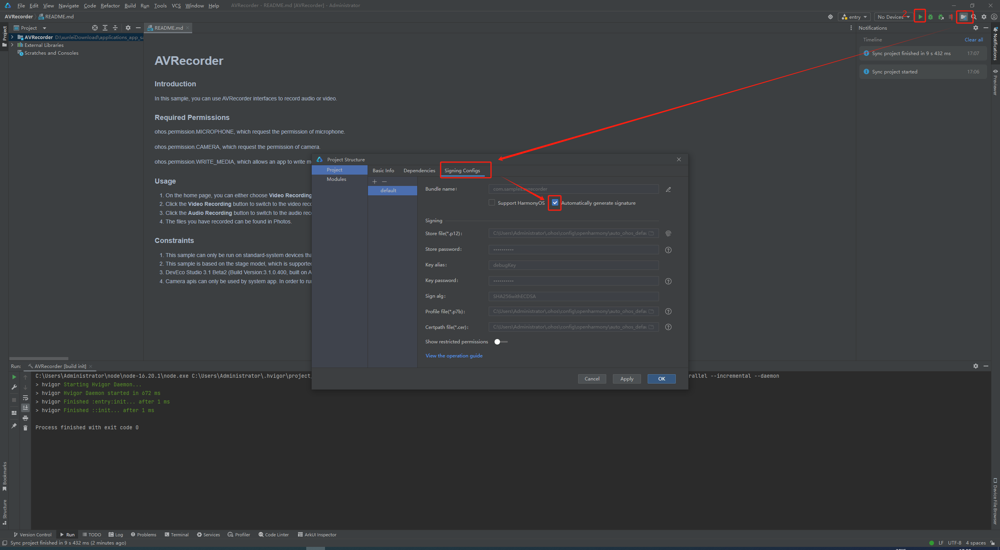

- [配置环境](#配置环境)
- [作业1](#作业1)
- [作业2](#作业2)

## 配置环境
**配置busybox**

**make install -j$(nproc)**

**安装qemu**

**配置Linux文件夹**
**安装bindgen工具**

**make LLVM=1 rustavailable**

## 作业1
**编译Linux内核 make x86_64_defconfig**

**make LLVM=1 menuconfig**

**make LLVM=1 -j$(nproc)**

**得到vmlinux文件夹**

## 作业2

